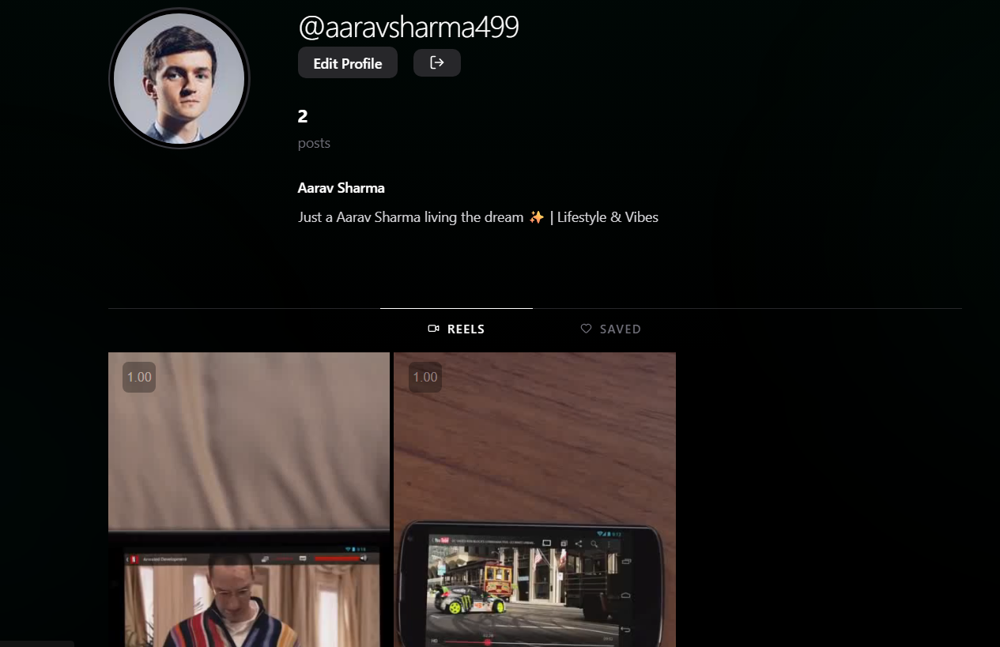
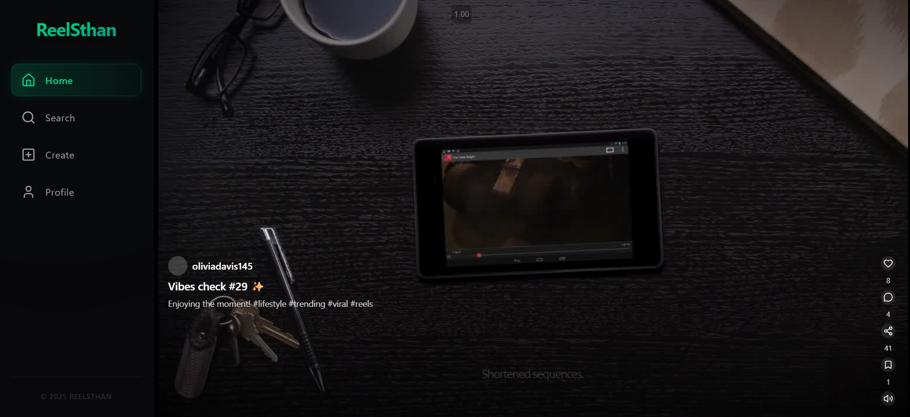
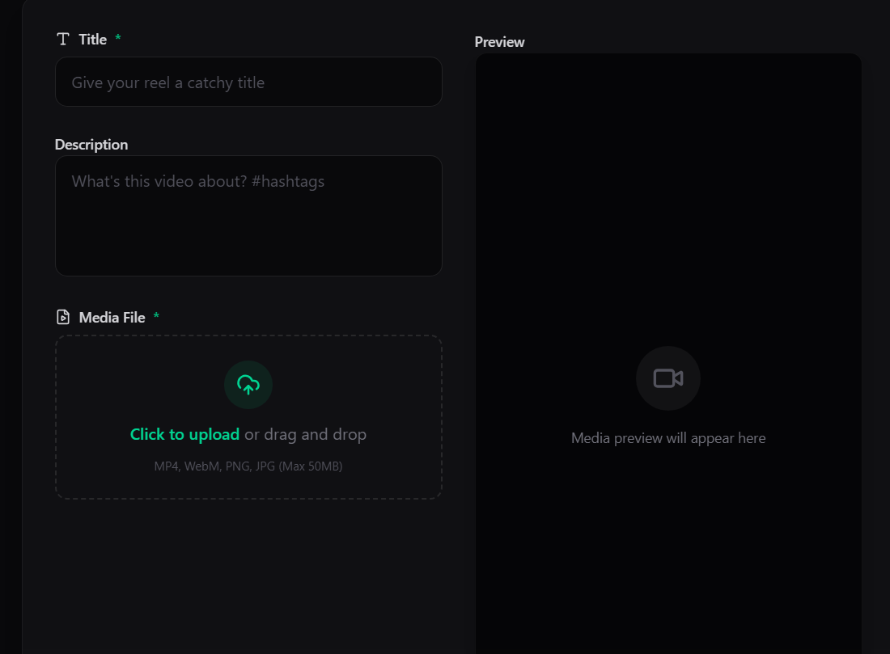

# ReelSthan 🎥

**ReelSthan** is a modern, mobile-first short video sharing platform built with the MERN stack (MongoDB, Express, React, Node.js). It features a sleek glassmorphism UI, infinite scroll feed, and robust user authentication.

 




## ✨ Features

- **📱 Mobile-First Experience**: Optimized for mobile devices with a responsive bottom navigation bar.
- **📹 Infinite Reel Feed**: Seamless video playback with autopause/play on scroll.
- **❤️ Interactions**: Like, comment, and save your favorite reels.
- **👤 User Profiles**: customizable profiles with avatars, bios, and video grids.
- **🔒 Secure Authentication**: JWT-based auth with email verification and password reset.
- **☁️ Cloud Storage**: Video and image uploads integration (ImageKit/Local).
- **🎨 Modern UI**: Built with TailwindCSS, featuring dark mode and glassmorphism effects.

## 🛠️ Tech Stack

### Frontend
- **React.js** (Vite)
- **TailwindCSS** (Styling)
- **Framer Motion** (Animations)
- **React Router DOM** (Navigation)
- **Lucide React** (Icons)
- **Axios** (API Requests)

### Backend
- **Node.js & Express.js**
- **MongoDB & Mongoose** (Database)
- **JWT** (Authentication)
- **Bcrypt.js** (Security)
- **Multer** (File Uploads)

## 🚀 Getting Started

### Prerequisites
- Node.js (v16+)
- MongoDB (Local or Atlas)

### Installation

1.  **Clone the repository**
    ```bash
    git clone https://github.com/yourusername/reelsthan.git
    cd reelsthan
    ```

2.  **Backend Setup**
    ```bash
    cd backend
    npm install
    ```
    - Create a `.env` file in the `backend` directory (see `.env.example`).
    - Run the database seeder (optional, for dummy data):
      ```bash
      npm run seed
      ```
    - Start the server:
      ```bash
      npm run dev
      ```

3.  **Frontend Setup**
    ```bash
    cd ../frontend
    npm install
    ```
    - Create a `.env` file in the `frontend` directory (see `.env.example`).
    - Start the development server:
      ```bash
      npm run dev
      ```

## 🔑 Environment Variables

### Backend (`backend/.env`)
```env
PORT=3000
MONGODB_URL=mongodb+srv://...
JWT_SECRET=your_secret_key
FRONTEND_URL=http://localhost:5173
NODE_ENV=development
```

### Frontend (`frontend/.env`)
```env
VITE_API_BASE_URL=http://localhost:3000/api
```

## 🤝 Contributing

Contributions are welcome! Please fork the repository and submit a pull request for any improvements.

## 📄 License

This project is licensed under the MIT License.
